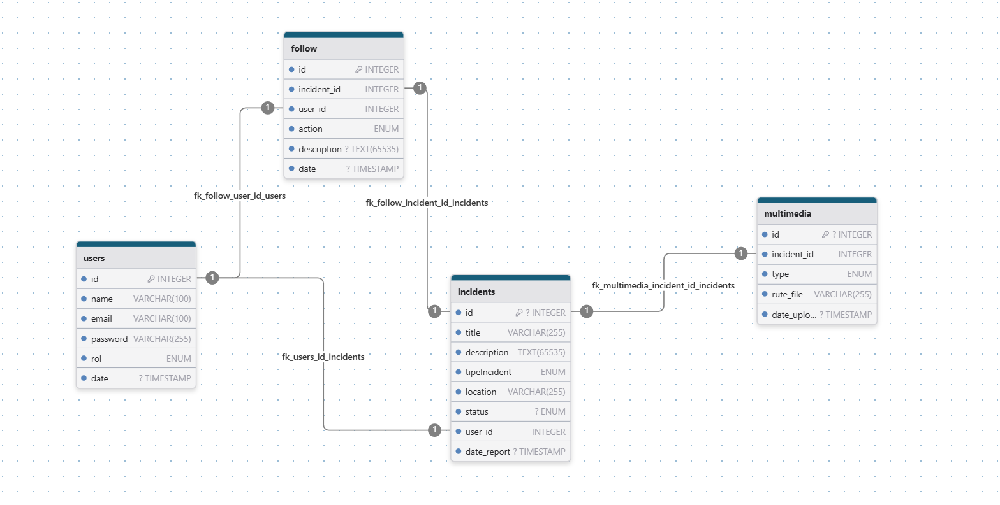

# **Sistema de incidencias ciudadanas**

>[!IMPORTANT]
> 
> Este proyecto consta de un sistema de incidencias ciudadanas, el cual permite registrar, consultar, modificar y eliminar registros de incidencias ciudadanas. Además, permite registrar usuarios para el acceso al sistema.

>[!NOTE]
>
> Este programa permite realizar lo siguiente:
> - Registrar datos.
> - Consultar registros.
> - Modificar registros.
> - Eliminar registro.
> - Registrar usuario.
>
> ¡Si deseas colaborar con el proyecto, puedes hacerlo!
> 
> Este repositorio cuenta con dos ejecutables:
> 1. **Ejecutable 1:** 'main.cpp' que tiene conexión con MySQL.
> 2. **Ejecutable 2:** 'sicArray.cpp' que utiliza arreglos y estructuras pero con limitaciones.

---

## **Características del proyecto**
- MySQL como base de datos.
- Manejo de excepciones.
- Estructuras de control selectivas.
- Estructuras de control repetitivas.
- Switch como expresión.
- C++ como lenguaje orientado a objetos.

### **Diagrama de actividad**

_Ilustración 1:_ Diagrama de actividad

---

## **main.cpp**

>[!NOTE]
>
>Administrado con Base de Datos

_Ilustración 2:_ Esquema de base de datos

>[!IMPORTANT]
> 
> En el esquema se visualiza dos tablas adicionales, 'seguimiento' y 'multimedia', las cuales no se han implementado en el proyecto.

| Ventajas                                                                                               | Desventajas                                                                                                       |
| ------------------------------------------------------------------------------------------------------ | ----------------------------------------------------------------------------------------------------------------- |
| **Persistencia automática:** Los datos no se pierden al cerrar el programa.                            | **Mayor complejidad:** Necesitas aprender SQL y manejar conexiones.                                               |
| **Eficiencia en consultas:** SQL permite buscar y filtrar datos de manera óptima.                      | **Requiere instalación/configuración:** Algunos motores de bases de datos necesitan instalación y administración. |
| **Escalabilidad:** Puede manejar grandes volúmenes de datos de forma eficiente.                        | **Consumo de recursos:** Puede ser excesivo para programas pequeños o de uso local.                               |
| **Integridad de datos:** Manejo de claves primarias, relaciones y restricciones evita inconsistencias. |                                                                                                                   |
| **Acceso concurrente:** Varios usuarios pueden leer/escribir datos simultáneamente.                    |                                                                                                                   |

### **Descripción**

#### **Componentes clave**
1. **Base de Datos (MySQL)**
   - **Tablas:** `incidencias`(id, título, descripción, tipo, ubicación, estado) y `usuarios`(id, nombre, email, contraseña, rol).
   - **Codificación:** `utf8mb4` para soportar caracteres especiales (ej. "dañada").
2. **Código C++**
   - **librerías principales:** `iostream`, `string`, `vector`, `mysql_driver`, `mysql_connection`, `cppconn`.
   - **Funciones clave:**
     - `mysql_real_connect()`: Conexión a la BD.
     - `mysql_query()`: Ejecución de consultas SQL.
     - `SetConsoleOutputCP(65001)`: Soporte para UTF-8 en Windows.
   - **Menús interactivos:** Switch-case para selección de opciones (tipo de incidencia, estado, rol de usuario).
3. **Interfaz de Usuario**
   - Colores diferenciados
   - Validación de datos:
     - IDs existentes
     - Opciones en menús (ej. 1-5 tipo de incidencia)

> [!WARNING]
>
> **Limitaciones:**
> 1. **Sistema Operativo:** Diseñado para Windows (usa SetConsoleOutputCP). En Linux requeriría ajustes con termios.
> 2. **Seguridad:** No hay autenticación de usuarios (todos pueden modificar incidencias).
> 3. **Rendimiento:** No optimizado para grandes volúmenes de datos (ej. miles de incidencias).
> 4. **Compatibilidad:** En cuanto a dispositivos de red, funciona mejor con equipos empresariales (Cisco) que con routers domésticos (TP-Link).

---

## **sicArrays.cpp**

>[!NOTE]
> 
>Administrado con Arreglos 'std::vector', 'struct/class', 'archivos (fstream)'.

| Ventajas                                                                                     | Desventajas                                                                                                                                         |
| -------------------------------------------------------------------------------------------- | --------------------------------------------------------------------------------------------------------------------------------------------------- |
| **Independencia:** No necesitas instalar ni configurar una base de datos externa.            | **No hay persistencia automática:** Si no usas archivos, los datos se pierden al cerrar el programa.                                                |
| **Mayor control:** Tú defines cómo se almacenan y manipulan los datos.                       | **Falta de eficiencia en grandes volúmenes de datos:** La búsqueda, actualización y eliminación pueden volverse lentas sin estructuras optimizadas. |
| **Menos recursos:** Ideal para programas pequeños o sin necesidad de concurrencia.           | **Gestión manual:** Tienes que programar desde cero las funciones para buscar, modificar y ordenar datos.                                           |
| **Rápido acceso en memoria:** Con `std::vector` o arreglos, las operaciones son muy rápidas. | **Dificultad en concurrencia:** No es fácil manejar múltiples accesos al mismo tiempo sin sincronización.                                           |

### **Descripción**

1. **Estructuras:** Se definen dos estructuras, Incidencia y Usuario, para almacenar la información de las incidencias y los usuarios, respectivamente.

2. **Arreglos:** Se utilizan arreglos para almacenar hasta un máximo de 100 incidencias y 100 usuarios.

3. **Funciones:** 
   - `registrarIncidencia()`: Permite registrar una nueva incidencia.
   - `eliminarIncidencia()`: Permite eliminar una incidencia existente.
   - `listarIncidencias()`: Muestra todas las incidencias registradas.
   - `registrarUsuario()`: Permite registrar un nuevo usuario.

4. **Menu Principal:** Un bucle do-while que muestra un menú y permite al usuario seleccionar diferentes opciones.

> [!WARNING] 
> 
> **Limitaciones:**
> 
> - No hay persistencia automática; los datos se pierden al cerrar el programa.
> - No hay validación de entrada robusta.
> - No se manejan errores de manera tan detallada como en una base de datos.